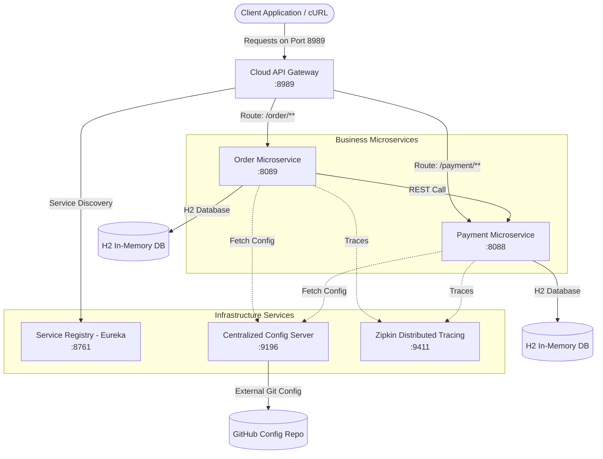

# Microservices E-Commerce Application

A production-ready microservices architecture built with **Java 17**, **Spring Boot 3.x**, and **Spring Cloud**. This project demonstrates centralized configuration, service registration and discovery, API gateway routing with circuit breakers, asynchronous transaction processing, and distributed tracing.

---

## 📐 Architecture Overview



---

## 📦 Services Summary

| Service Name | Directory / Module | Port | Eureka Service Name | Description |
| :--- | :--- | :---: | :---: | :--- |
| **Service Registry** | `service-registry` | `8761` | N/A | Eureka Server for service registration and discovery. |
| **Config Server** | `service-config` | `9196` | `SERVICE-CONFIG` | Spring Cloud Config Server backed by Git. |
| **Cloud API Gateway** | `cloud-gateway` | `8989` | `GATEWAY-SERVICE` | Entry point with dynamic routing & Circuit Breakers. |
| **Order Service** | `oder` | `8089` | `ORDER-SERVICE` | Handles order creation and coordinates payment processing. |
| **Payment Service** | `payment` | `8088` | `PAYMENT-SERVICE` | Processes payment transactions and maintains payment state. |
| **Zipkin Server** | External Bin/Docker | `9411` | N/A | Distributed tracing collector and dashboard. |

---

## ✨ Key Features & Technology Stack

- **Java 17 & Spring Boot 3.3.4 / 3.1.1**: Core framework for modern Java microservices.
- **Service Discovery (Netflix Eureka Server)**: Dynamic registration and discovery of all system microservices (`http://localhost:8761`).
- **Centralized Configuration (Spring Cloud Config)**: Centralized configuration management using remote Git repository (`https://github.com/raj4rr/config-server.git`).
- **API Gateway (Spring Cloud Gateway)**: Single entry point managing route predicates, load balancing (`lb://`), and rate limiting/fallback routing.
- **Circuit Breaker & Resilience**: Resilience4j & Hystrix integration to provide instant automated fallbacks (`/orderFallBack`, `/paymentFallBack`) if downstream services fail.
- **In-Memory Database & JPA**: H2 Database (`jdbc:h2:mem:...`) with Spring Data JPA for transient transaction management and H2 Console access.
- **Distributed Tracing & Observability**: Micrometer Tracing Bridge Brave, SLF4J MDC context tracking (`traceId`, `spanId`), Zipkin Reporter, and Spring Boot Actuator metrics.

---

## 🚀 Getting Started

### Prerequisites

- **Java 17 SDK** or higher installed
- **Apache Maven 3.8+** (or use bundled `./mvnw`)
- **Git**

### Execution & Startup Order

To start the system correctly, launch the microservices in the following sequential order:

1. **Zipkin Server** (Optional, for tracing):
   ```bash
   docker run -d -p 9411:9411 openzipkin/zipkin
   ```

2. **Service Registry** (`service-registry`):
   ```bash
   cd service-registry
   ./mvnw spring-boot:run
   ```
   *Dashboard available at:* `http://localhost:8761`

3. **Config Server** (`service-config`):
   ```bash
   cd service-config
   ./mvnw spring-boot:run
   ```
   *Running on:* `http://localhost:9196`

4. **Payment Service** (`payment`):
   ```bash
   cd payment
   ./mvnw spring-boot:run
   ```
   *Running on:* `http://localhost:8088`

5. **Order Service** (`oder`):
   ```bash
   cd oder
   ./mvnw spring-boot:run
   ```
   *Running on:* `http://localhost:8089`

6. **Cloud API Gateway** (`cloud-gateway`):
   ```bash
   cd cloud-gateway
   ./mvnw spring-boot:run
   ```
   *Running on:* `http://localhost:8989`

---

## 📡 API Reference & cURL Examples

All client requests should be routed through the **API Gateway** (`http://localhost:8989`).

### 1. Create Order & Process Transaction

**Endpoint:** `POST http://localhost:8989/order/add`

```bash
curl --location 'http://localhost:8989/order/add' \
--header 'Content-Type: application/json' \
--data '{
   "order": {
     "id": 2,
     "name": "Mobile",
     "quantity": 1,
     "totalPrice": 20000
   },
   "payment": {}
}'
```

*(Direct Service Endpoint: `POST http://localhost:8089/order/add`)*

### 2. Execute Payment Directly

**Endpoint:** `POST http://localhost:8989/payment/dopayment`

```bash
curl --location 'http://localhost:8989/payment/dopayment' \
--header 'Content-Type: application/json' \
--data '{
    "orderId": "12",
    "ammount": 199
}'
```

*(Direct Service Endpoint: `POST http://localhost:8088/payment/dopayment`)*

---

## 🛡️ Circuit Breakers & Resilience

Spring Cloud Gateway is configured with circuit breaker fallbacks. If a microservice becomes unavailable or experiences latency exceeding thresholds, requests are gracefully redirected:

- **Order Service Fallback Route**: `/orderFallBack`
  - *Response:* `"Order Service is taking too long to respond or is down. Please try again later"`
- **Payment Service Fallback Route**: `/paymentFallBack`
  - *Response:* `"Payment Service is taking too long to respond or is down. Please try again later"`

---

## 🔍 Observability & Monitoring

- **Eureka Dashboard**: `http://localhost:8761`
- **Zipkin Tracing UI**: `http://localhost:9411`
- **H2 Consoles**:
  - Order DB: `http://localhost:8089/h2-console` (JDBC URL: `jdbc:h2:mem:order`)
  - Payment DB: `http://localhost:8088/h2-console` (JDBC URL: `jdbc:h2:mem:payment`)
- **Actuator & Hystrix Metrics Stream**: `http://localhost:8989/actuator/hystrix.stream`
- **Central Config Git Repository**: `https://github.com/raj4rr/config-server.git`
